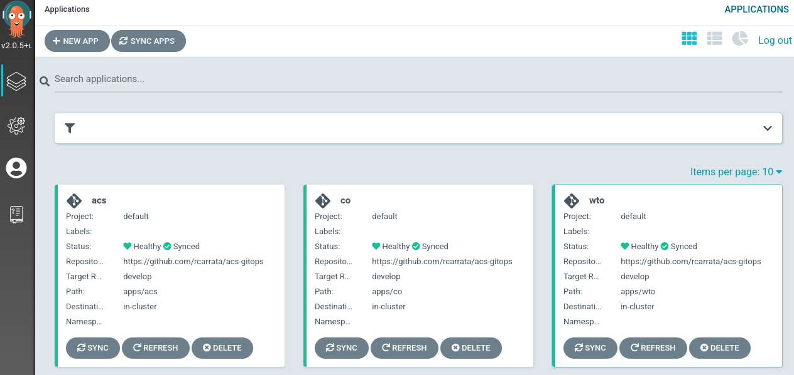
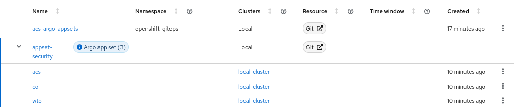
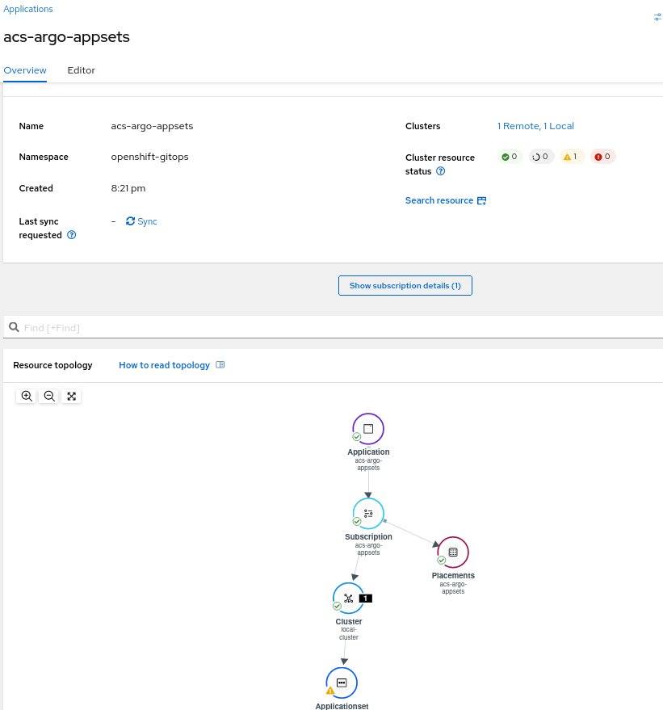
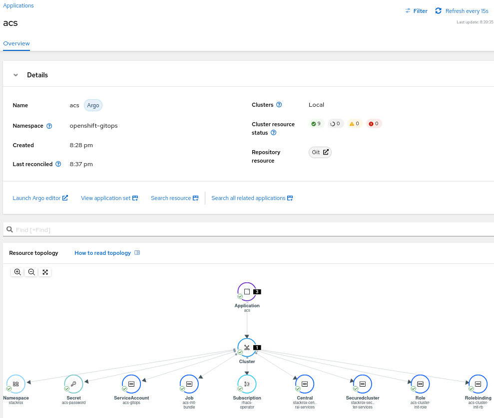

# RHACS Installation using Openshift GitOps

Repository for install [Advanced Cluster Security for Kubernetes](https://cloud.redhat.com/products/kubernetes-security) using Openshift GitOps and/or ACM

# 1. Prerequisites

## Bootstrap Openshift GitOps / ArgoCD

```
until oc apply -k bootstrap/base/; do sleep 2; done
```

# 2. ACS with GitOps

This demo contains 4 modes of Installation

* A - Argo App of Apps
* B - ApplicationSets
* C - ACM Applications (WIP)
* D - ACM ApplicationSet (WIP)

## A - Install ACS through gitops using App of Apps (in local cluster)

```
oc apply -k acs-deploy/applications
```

## B - Install ACS through gitops using ApplicationSets (in local cluster)

```
oc apply -k acs-deploy/applicationsets
```


## C - Install ACS from ACM using Argo Applications (in multiple managed clusters)

* Under Construction

## D - Install ACS from ACM using Argo ApplicationSets (in multiple managed clusters)

```
oc apply -k acm-gitops/applicationsets
```

* ACM ApplicationSets management from GitOps



* Application for manage the ArgoApplicationSets for deploy ACS among others



* Installation of ACS from ApplicationSet automatically



# 3. Video of the Demo

* [Small Video Demonstration](https://youtu.be/33XuvCPLZ58) about ACS installed using Openshift GitOps

Enjoy!
